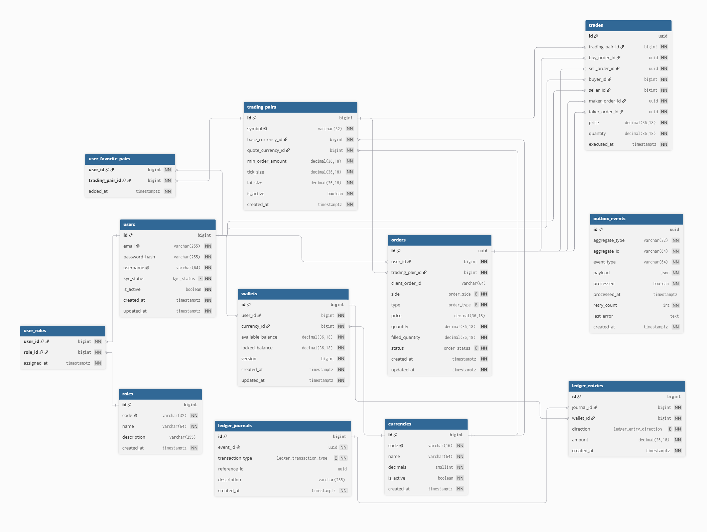

# Crypto Exchange

Индивидуальное задание
- Тема: криптобиржа

## SonarCloud

https://sonarcloud.io/project/overview?id=cyffrezynedd_crypto-exchange

## План

Оценка до задачи: `E = (P + O + 4 * BG) / 6`
- P — пессимистичная оценка,
- O — оптимистичная оценка,
- BG — наиболее вероятная оценка.


| Этап | Задача | Запланированное время | Фактическое время |
|------|--------|-----:|-------------------:|
| 1 | БД — схема (мин. 7 таблиц, M2M), PostgreSQL, схему и SQL в git | 3.2ч | 2.5ч |
| 2 | JDBC — консольное приложение, CRUD (отдельная ветка) | 2.3ч | 2ч |
| 3 | Backend — Spring Boot + Hibernate | 16.5ч | 14ч |
| 4 | Frontend — React | 8ч | 9ч |
| 5 | Frontend — Angular | 8ч | 7.5ч |
| 6 | Запуск приложения в Docker | | |

## Этап 1 — БД

- PostgreSQL
- 12 таблиц
- SQL: `backend/migrations/`
- Диаграмма: `docs/schema.png` (`docs/schema.dbml`)
- M2M: `user_roles`, `user_favorite_pairs`

Оценка времени (этап 1):
- пессимистичная (P) — 5 ч
- оптимистичная (O) — 2 ч
- наиболее вероятная (BG) — 3 ч

`E = (P + O + 4 * BG) / 6 = (5 + 2 + 4 * 3) / 6 = 19 / 6 ≈ 3.2 ч`

### Схема



## Этап 2 — JDBC (ветка `feature/jdbc`)

- Код: `backend/jdbc-console/`
- CRUD: users, currencies, user_roles (M2M)
- Dev: `Makefile`, `docker-compose.yml`

Оценка времени (этап 2):
- пессимистичная (P) — 4 ч
- оптимистичная (O) — 1.5 ч
- наиболее вероятная (BG) — 2 ч

`E = (P + O + 4 * BG) / 6 = (4 + 1.5 + 4 * 2) / 6 = 13.5 / 6 ≈ 2.3 ч`

Фактически: **2 ч**

```bash
copy .env.example .env
copy backend\jdbc-console\src\main\resources\db.properties.example backend\jdbc-console\src\main\resources\db.properties

make db-up
make migrate
make run-jdbc
```

Нужен `make` (Git Bash / `choco install make`) и Docker.

## Этап 3 — Spring Boot + Hibernate (ветка `main`)

Микросервисы в `backend/` (гексагональная архитектура: `domain` / `port` / `adapter`):

| Сервис | Порт | Назначение |
|--------|-----:|------------|
| `api-gateway` | 8080 | маршрутизация, JWT, CORS, circuit breaker |
| `iam-service` | 8081 | пользователи, роли, авторизация, аутентификация |
| `clearing-service` | 8082 | кошельки |
| `trading-service` | 8083 | ордера, outbox паттерн при помощи кафки |
| `market-data-service` | 8084 | торговые пары, проекция сделок |
| `exchange-common` | — | DTO, JWT, proto, общие ошибки |

Инфраструктура (`docker-compose.yml`): PostgreSQL, Redis, Kafka, Consul, SQL-миграции.

Gateway-маршруты (версия **v1**): `/api/v1/iam`, `/api/v1/trading`, `/api/v1/clearing`, `/api/v1/market`  
Публичные пути без JWT: `POST /api/v1/iam/users`, `POST /api/v1/iam/auth/login`, `POST /api/v1/iam/auth/refresh`, `GET /api/v1/market/pairs`  
Мета: `GET /api/gateway/info` (поля `version`, `apiVersion`)  

Оценка времени (этап 3):

- пессимистичная (P) — 24 ч
- оптимистичная (O) — 12 ч
- наиболее вероятная (BG) — 16 ч

`E = (P + O + 4 * BG) / 6 = (24 + 12 + 4 * 16) / 6 = 100 / 6 ≈ 16.5 ч`

### Сборка и тесты

```bash
cp .env.example .env
cd backend && mvn test
```

### Запуск

Полный бэкенд (PostgreSQL, Redis, Kafka, Consul, все сервисы). Снаружи доступен только gateway **:8080**:

```bash
make up
make smoke-api
```

Остановка: `make down`

Локальная отладка отдельных сервисов (инфра в Docker, Java на хосте):

```bash
make infra-up
make migrate
cd backend && mvn install
make run-iam
make run-gateway
```

## Этап 4 — React (`frontend/react`)

SPA на Vite + React 18. Главный экран — **избранные пары (M2M)** с фильтрами и **пагинацией на backend**
Также: рынок, ордера, кошельки, авторизация, фильтры + page/size

Оценка времени (этап 4):

- пессимистичная (P) — 12 ч
- оптимистичная (O) — 6 ч
- наиболее вероятная (BG) — 8 ч

`E = (P + O + 4 * BG) / 6 = (12 + 6 + 4 * 8) / 6 = 50 / 6 ≈ 8.3 ч`

Фактически: **9 ч**

```bash
make up
cd frontend/react
npm install
cp .env.example .env
npm run dev
```

dev-сервер: http://localhost:5173

## Этап 5 — Angular (`frontend/angular`)

Тот же API и визуал, что в React: главная — M2M избранные пары, рынок, ордера, кошельки 
Standalone Angular 19, общие CSS из `frontend/react`

Оценка времени (этап 5):

- пессимистичная (P) — 11 ч
- оптимистичная (O) — 5.5 ч
- наиболее вероятная (BG) — 8 ч

`E = (P + O + 4 * BG) / 6 = (11 + 5.5 + 4 * 8) / 6 = 48.5 / 6 ≈ 8.1 ч`

Фактически: **7.5 ч**

```bash
make up
cd frontend/angular
npm install
npm start
```

dev-сервер: http://localhost:4200
